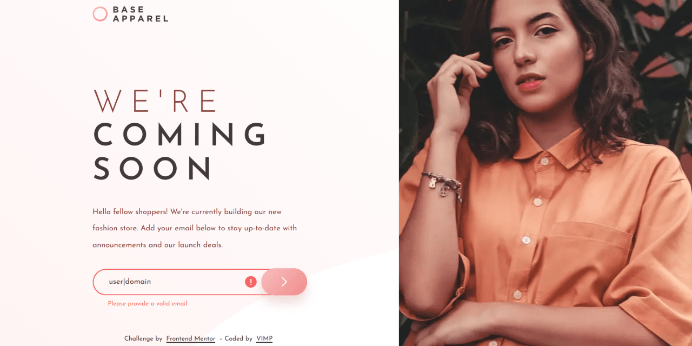
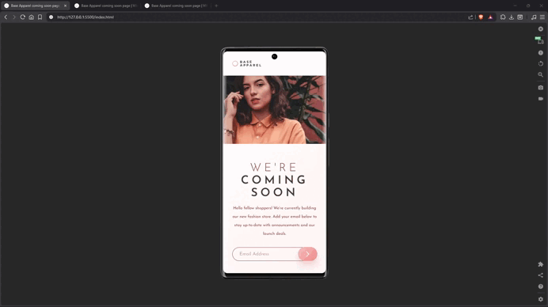

# Base Apparel coming soon page




Responsive coming soon landing page with accessible email validation built using semantic HTML, modern CSS architecture, and the Constraint Validation API.

This is a solution to the [Base Apparel coming soon page challenge on Frontend Mentor](https://www.frontendmentor.io/challenges/base-apparel-coming-soon-page-5d46b47f8db8a7063f9331a0).

---

## 🔗 Links

- 🌎 [Live site](https://vimpdev.github.io/fem-newbie-js-03-base-apparel-coming-soon/)
- 📌 [Frontend Mentor solution](https://www.frontendmentor.io/solutions/base-apparel-responsive-landing-page-with-accessible-validation-paw2gL_Wsa)

---

## 🎬 Demo



---

## 📸 Screenshots

### 📱 Mobile

| Validation states | Success states |
| --- | --- |
|  |  |

### 📲 Tablet

| Validation states | Success states |
| --- | --- |
|  |  |

### 🖥️ Desktop

| Default | Invalid email |
| --- | --- |
|  |  |

| Valid email | Success dialog |
| --- | --- |
|  |  |

---

## ✨ Features

- Mobile-first responsive layout
- Adaptive hero images using `<picture>`
- Accessible email validation using the **Constraint - Validation API**
- Real-time validation feedback
- Error icon and inline validation messaging
- Success dialog using the native `<dialog>` element
- Keyboard-accessible interactive states
- CSS architecture using `@layer` and native CSS nesting

---

## 🛠 Built With

- Semantic HTML5
- Modern CSS
  - CSS Custom Properties
  - CSS Grid
  - Flexbox
  - Native CSS Nesting
  - `@layer`
  - `clamp()`
  - Logical properties
- Vanilla JavaScript
- Constraint Validation API
- Mobile-first workflow

---

## 🧠 What I Learned

This project helped reinforce several frontend fundamentals beyond simply reproducing a layout.

### Responsive image strategy

Instead of using a single image across all breakpoints, the layout uses the <picture> element with dedicated mobile, tablet, and desktop assets:
```html
<picture class="hero-media">
  <source media="(min-width: 75rem)" srcset="./assets/images/hero/desktop.webp">
  <source media="(min-width: 37.5rem)" srcset="./assets/images/hero/tablet.webp">
  
</picture>
```

### Native form validation with better UX

The form validation was implemented using the browser’s built-in validation system instead of custom regex-heavy JavaScript.
```js
function validateField() {
  const isValid = $email.checkValidity();

  if (!isValid) {
    showError();
    return false;
  }

  clearError();
  return true;
}
```
This approach keeps the logic simpler, more maintainable, and accessible.

### CSS architecture with @layer

The stylesheet is organized into layered sections to separate responsibilities clearly:
```css
@layer reset, fonts, tokens, base, layout, components, utilities, responsive, states;
```
This made the project easier to scale and reason about while developing responsive states and component behaviors.

---

## 🧩 Validation Flow (Pseudocode)

```text
ON form submit
  PREVENT default submission

  VALIDATE email field

  IF email is invalid
    SHOW error message
    SHOW error icon
    MARK input as invalid
    STOP

  CLEAR validation state
  RESET form
  OPEN success dialog


ON input blur
  IF field is not empty
    VALIDATE field


ON input event
  IF an error is currently visible
    REVALIDATE field in real time
```

---

## ♿ Accessibility Notes

- Semantic landmarks (`header`, `main`, `footer`)
- Hidden accessible labels using `.visually-hidden`
- `aria-invalid` applied dynamically
- `aria-describedby` connected to validation messaging
- `aria-live="polite"` for screen reader feedback
- Keyboard-accessible focus states
- Native dialog behavior via `<dialog>`

---

## 🤖 AI Collaboration

AI tools were used as a collaborative learning resource during development for:

- Reviewing accessibility decisions
- Discussing CSS architecture tradeoffs
- Exploring modern CSS features
- Refining validation logic
- Improving naming consistency and project structure

All implementation, styling, and final code decisions were manually developed and integrated into the project workflow.

---

## 👩‍💻 Author

- Frontend Mentor – [@vimpdev](https://www.frontendmentor.io/profile/vimpdev)

---